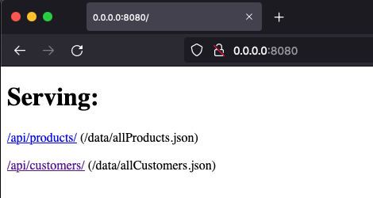
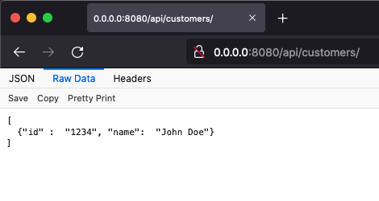

# Simple REST JSON server

Run a HTTP REST server that serves JSON<sup>*</sup> content from files.

<sup>* other file types work as well, the `content-type` is determined by the file extension.</sup>

It's a couple of lines of Kotlin [code](src/main/kotlin/Application.kt), using [Ktor](https://ktor.io/) and [Clikt](https://ajalt.github.io/clikt/).





_If you need a more advanced mock REST JSON server, then please have a look at [JSON Server](https://github.com/typicode/json-server)._ 

---

## Usage

Provide REST path and file mapping 'routes' as arguments, e.g.:

```
--route "/api/products/=/data/allProducts.json"
--route "/api/customers/=/data/allCustomers.json"
etc.
```

### Run with Docker 🐳

A pre-build image can be found here: [rlindooren/simple-rest-json-server:latest](https://hub.docker.com/r/rlindooren/simple-rest-json-server/tags)

```shell
# Update this to match your own set-up
DATA_DIR="$(pwd)/example-data/"
PORT=8080

docker run \
  --rm \
  --volume "${DATA_DIR}:/data/" \
  -p "${PORT}:${PORT}" \
  --env "PORT=${PORT}" \
  rlindooren/simple-rest-json-server:latest \
  --route "/api/products/=/data/allProducts.json" \
  --route "/api/customers/=/data/allCustomers.json"
```

Then goto [http://localhost:8080/](http://localhost:8080/).

### Run with Gradle

```shell
./gradlew run --args="--route /api/products/=example-data/allProducts.json --route /api/customers/=example-data/allCustomers.json"
```

### Build Docker image

```shell
./gradlew installDist

docker build -t simple-rest-json-server .
```

```shell
# Update this to match your own set-up
DATA_DIR="$(pwd)/example-data/"
PORT=8080

docker run \
  --rm \
  --volume "${DATA_DIR}:/data/" \
  -p "${PORT}:${PORT}" \
  --env "PORT=${PORT}" \
  simple-rest-json-server \
  --route "/api/products/=/data/allProducts.json" \
  --route "/api/customers/=/data/allCustomers.json"
```

When serving really large files you may have to extend the available memory(?).
For example like so:

```shell
docker run \
  --env "JAVA_OPTS=-Xmx2024M" \
  --memory=2g \
  ...
```
